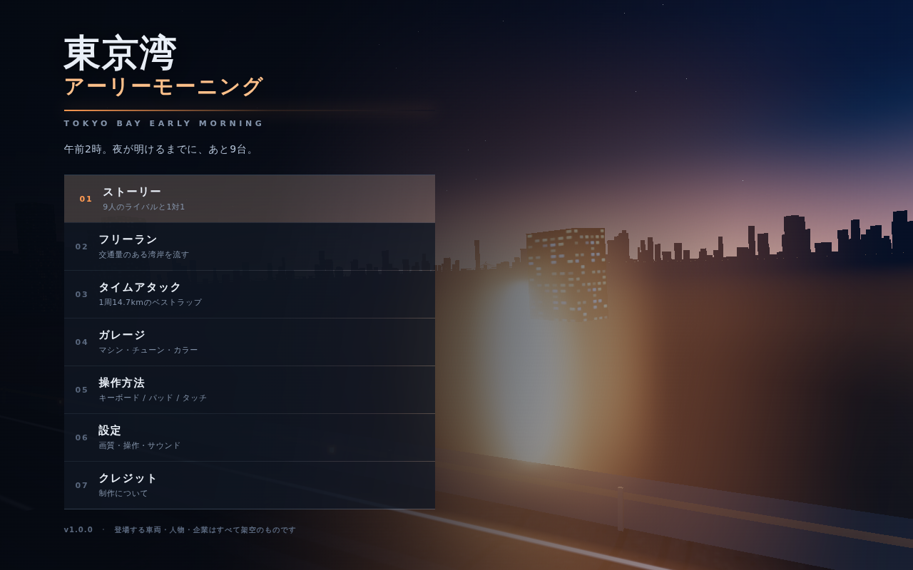

# 東京湾アーリーモーニング

**TOKYO BAY EARLY MORNING** — 午前2時から夜明けまでの東京湾岸を舞台にした、
三人称視点のハイスピードレースゲームです。ブラウザだけで動き、ビルドも外部アセットも要りません。



---

## 遊びかた

```bash
git clone <このリポジトリ>
cd hatahuri
python3 -m http.server 8080
# → http://localhost:8080/
```

ES モジュールを使っているため、`file://` で直接開くと動きません。簡易サーバー経由で開いてください。

### 1ファイル版
配布用に、全モジュールを1枚の HTML にまとめられます。

```bash
node tools/build-single.mjs dist/tokyo-bay-early-morning.html https://cdn.jsdelivr.net/npm/three@0.160.0
```

`dist/tokyo-bay-early-morning.html`（約170KB）はリポジトリにも入れてあります。
1枚だけ置ける場所にそのまま貼れば動きます。

### GitHub Pages
Settings → Pages → Source をこのブランチの `/ (root)` にするだけです。
three.js は `vendor/` に同梱しているので、外部CDNへの依存はありません。

---

## 操作

| 操作 | キーボード | ゲームパッド |
|---|---|---|
| アクセル | `↑` `W` | RT |
| ブレーキ | `↓` `S` | LT |
| ステア | `←` `→` / `A` `D` | 左スティック |
| シフトアップ | `E` `Shift` | RB |
| シフトダウン | `Q` `Ctrl` | LB |
| サイドブレーキ | `Space` | A |
| カメラ切替 | `C` | — |
| リスタート | `R` | — |
| ポーズ | `Esc` | — |

メニューは `↑` `↓` と `Enter` だけで操作できます。
スマホ・タブレットでは設定からタッチ操作パネルを出せます。

---

## ステージ

12のステージがあります。長さも性格も別物で、同じ車が全部で強いということはありません。

| ステージ | 舞台 | 全長 | 性格 |
|---|---|---|---|
| 湾岸ベイサイド | 東京湾岸線 | 14.7 km | 標準。長い直線とゆるい大R |
| アクアライン往復 | 木更津 — 川崎 | 24.8 km | 超ロング。66%がトンネル、最高速がすべて |
| 海ほたる スパイラル | 海ほたる | 4.2 km | ショート。一瞬でしか差がつかない |
| 大黒ジャンクション | 大黒ふ頭 | 6.9 km | 曲がりすぎ。曲がれる車が勝つ |
| 辰巳ライン | 辰巳 — 有明 | 9.6 km | 複合。トンネルと橋が交互 |
| 空港中央 ナイトラン | 羽田 — 浮島 | 5.4 km | ショート。全開区間からいきなり複合コーナー |
| みなとみらい | 横浜 — ベイブリッジ | 11.8 km | 市街。中速コーナーの連続、壁が近い |
| 東京湾グランドツアー | 一周 | 34.0 km | 馬鹿長い。全部入り |
| 川崎コンビナート | 浮島 — 千鳥町 | 7.6 km | 曲がりすぎ。直線らしい直線がない |
| 渋滞の辰巳 | 辰巳 — 有明 | 8.2 km | 一般車が異常に多い。抜けるラインを探す |
| 雨の湾岸 | 東京湾岸線 — 雨 | 13.2 km | **路面が濡れている。**グリップが2割落ちる |
| 幕張ロングストレート | 幕張 — 千葉 | 18.6 km | 延々と続く直線。踏み切れるかどうか |
| 川崎コンビナート | 浮島 — 千鳥町 | 7.6 km | 曲がりすぎ。直線らしい直線がない |
| 渋滞の辰巳 | 辰巳 — 有明 | 8.2 km | 一般車が異常に多い。抜けるラインを探す |
| 雨の湾岸 | 東京湾岸線 — 雨 | 13.2 km | **路面が濡れている。**グリップが2割落ちる |
| 幕張ロングストレート | 幕張 — 千葉 | 18.6 km | 延々と続く直線。踏み切れるかどうか |

ベストラップは「ステージ×車種」ごとに残ります。

**雨のステージ**では路面の摩擦が約2割落ち、止まらず・曲がらなくなります。
路面の映り込みが強くなり、霧が濃くなり、タイヤが水を巻き上げます。
ライバルAIもグリップの低下を織り込んで進入速度を落とします。

**雨のステージ**では路面の摩擦が約2割落ち、止まらず・曲がらなくなります。
見た目も路面の映り込みが強くなり、霧が濃くなり、タイヤが水を巻き上げます。
ライバルAIもグリップの低下を織り込んで、進入速度を落とします。

コースは `src/courses.js` の定義から手続き生成されます。
半径の揺らぎ（`radius.harmonics`）、楕円のつぶし具合（`aspect`）、区間の配合（`zones`）を
書き換えるだけで新しいステージが作れます。全長は指定した値に自動でスケールされ、
片側3車線に収まらないヘアピンができないよう最小半径も自動で保証されます。

## モード

- **ストーリー** — 9人のライバルと1対1。ステージは相手ごとに決まっています。
- **フリーラン** — 好きなステージを交通量ありで流します。
- **タイムアタック** — 好きなステージで1周のベストラップに挑みます。
- **ガレージ** — マシンの購入・6項目のチューン・カラー変更（3Dプレビュー付き）。

### バトルの仕組み
先行しているあいだ、相手の体力ゲージが減ります。**車間が開くほど減りが速い**方式です。

- 相手のゲージがゼロになるか、400m以上離せば勝ち
- 前車の40m以内でスリップストリームが効き、空気抵抗が約4割減ります
- 追越車線には一般車が入ってこないので、全開で使えます

---

## 収録マシン

| 型式 | メーカー | モデル | 駆動 | エンジン |
|---|---|---|---|---|
| NS30 | NISHIMURA | ゼファー 280 | FR | 直6 2.8L ターボ |
| B930 | BRENNER | ターボ 3.3 | RR | 水平対向6 3.3L ターボ |
| NR34 | NISHIMURA | スカイワード GTX | AWD | 直6 2.6L ツインターボ |
| NR32 | NISHIMURA | スカイワード GTX | AWD | 直6 2.6L ツインターボ |
| KD3 | KAMIYA | ロータ セブン | FR | 2ローター ツインターボ |
| AZ80 | AKATSUKI | アロー 3000GT | FR | 直6 3.0L ツインターボ |
| MA1 | MISORA | エイペックス MR | MR | V6 3.0L 可変バルブ（NA） |
| NS15 | NISHIMURA | セイレン 2000 | FR | 直4 2.0L ターボ |
| IS9 | ISUKA | テンペスト VI | AWD | 直4 2.0L ターボ |
| HG8 | HOSHIKAWA | ポラリス RS | AWD | 水平対向4 2.0L ターボ |

車両・メーカー・人物・企業はすべて架空です。性能値は1990年代の同クラス車を参考にした調整値です。

> **名称の切り替え**
> `src/cars.js` の `NAMING` を `'reference'` にすると、参考にした実在車の名称で表示されます。
> ただし車名・メーカー名・エンジン型式は商標なので、**配信・公開時は既定の `'original'` のままにしてください**。

車体の3Dモデルは断面をつないで生成（ロフト）しています。
`src/cars.js` の断面データを書き換えると、そのままシルエットが変わります。

---

## 技術メモ

| ファイル | 役割 |
|---|---|
| `src/main.js` | 画面遷移・メニュー・ゲームループ |
| `src/game.js` | シーン構築・カメラ・当たり判定・モード管理 |
| `src/actors.js` | 走行中の車体・粒子と、シーングラフの後始末 |
| `src/vehicle.js` | 車両物理（トルク特性・過給・タイヤ・荷重移動） |
| `src/ai.js` | ライバルAI |
| `src/courses.js` | 8ステージの定義 |
| `src/track.js` | コース生成と路面メッシュ |
| `src/scenery.js` | 空・海・街・地面・トンネル・橋・街灯・標識・路側 |
| `src/carModel.js` | 車体の手続き的モデリング |
| `src/traffic.js` | 一般車（対向車あり） |
| `src/hud.js` | メーター・ミニマップ |
| `src/audio.js` | WebAudio によるリアルタイム合成 |
| `src/input.js` | キーボード / ゲームパッド / タッチ |
| `src/save.js` | localStorage へのセーブ |
| `tools/build-single.mjs` | 1ファイル版のビルド（名前衝突の検出つき） |
| `vendor/` | three.js r160 と後処理（ブルーム） |

### 設計のポイント

- **最高速はカタログ値ではなく、出力と空気抵抗の釣り合いで決まります。**
  そのぶんチューンの効き方が「速い車ほど伸びにくい」と自然になります。
- **最終減速比は「目標最高速でレッドに当たる」ように逆算**しているので、
  ギア比チューンを上げると自動的にハイギアードになります。
- **旋回は前後2輪モデル＋摩擦円。** 荷重移動とダウンフォースを見ています。
  タイヤが支えられる旋回速度の上限を超えたぶんは減衰させ、
  一度スピンしたら戻せない状態を防いでいます（サイドブレーキ中は補正が緩みます）。
- **衝突は押し出し＋運動量保存。** 一般車にも質量があり、
  大型トラックに突っ込めばこちらが弾かれます。
- **夜景の環境マップを起動時に1度だけ焼き込み**、ボディと路面に映り込ませています。
  これがないと、夜はどれだけ造形を足しても真っ黒な塊にしか見えません。
- **街灯そのものが光源です。** 45mおきの灯りの下を通るたびにボディが明るくなります。
- **建物はコースとの距離を判定してから建てます。** 周回路が自分の近くを通る場所で、
  建物が路上に生えるのを防ぐためです。
- **壁ずりは「時間あたりの摩擦」で計算します。** フレームあたりの割合で減速させると、
  60fpsでは1秒で速度がほぼ消え、フルスロットルでも壁から離れられなくなります。
- **ライバルAIは Stanley 制御＋曲率のフィードフォワード**でラインを保ちます。
  「先の1点へ向ける」方式は、高速で小さな向きのズレが大きな舵になり、
  中央分離帯すれすれの追越車線で左右に振れて壁を擦り続けます。
- **コーナー進入の先読み距離は速度に比例**させています。固定距離だと、
  速いほど減速が間に合わなくなります。
- **最大舵角はグリップから逆算**しています。
  `必要舵角 = ホイールベース × 使える横G ÷ 速度²` を基準に、過渡ぶんの余裕1.45倍。
  速度で割るだけの式だと 216km/h でも6度切れますが、同じ速度で限界旋回に必要な
  舵角は0.5度ほどしかなく、限界の10倍以上を一気に入れられる状態でした。
  少し傾けただけでタイヤが飽和し「勝手に曲がる」感触の正体がこれです。
  入力にはエキスポ（1.55乗）も掛け、中央付近の微調整を効きやすくしています。
  あわせてフロントのコーナリングパワーを抑え、鼻の入りを穏やかにしています。
  AIは角度を直接指令するので、この割り当ては人間の入力にだけ適用します
  （メニュー背景のデモは自車をAIが運転するので、そちらも機械側の扱いにします）。

### 動作確認
Chromium（headless / SwiftShader）＋ Playwright で、起動・全画面遷移・走行・
バトル成立・チューン購入・リザルト表示まで一通り通ることを確認しています。
建物とコースの干渉（全インスタンス）、追突時の車体のめり込み、
ステアの左右対称性に加えて、**全8ステージをAIに3分ずつ走らせ**、
停止・壁への貼り付き・コース逸脱が起きないことも自動で検証しています。
